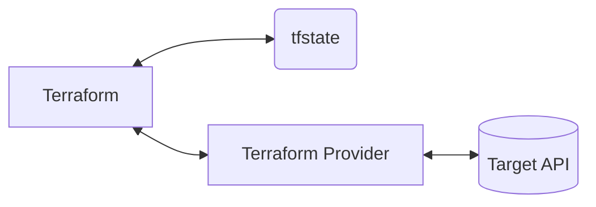

# Microsoft Entra IDをTerraformで運用する

---
layout: two-cols-header
class: grid content-center pr-10
---

# 自己紹介

::left::

{class="rounded-full p-10"}

::right::

Tadayuki Onishi @FOLIO

[<carbon-logo-twitter /> @kenchan0130](https://twitter.com/kenchan0130)

---
layout: two-cols
class: pr-5
---

# 話すこと

* Terraformの概要
* TerraformへのDeep Dive
  * TerraformでMicrosoft Entra IDを運用する際に困ったことおよび、あれば対応策の紹介
* Microsoft Graph APIに対するぼやき

::right::

# 話さないこと

* Terraformの基本的な使い方
* Terraformの基本的な構文

---
layout: statement
---

# Terraformざっくり概要

---

# Terraformとは

宣言的なコードでインフラストラクチャを管理するツール

<div class="grid grid-cols-2">

{class="h-65 m-auto"}

<div class="grid grid-rows-2">

<div>

* HashiCorp社がBSL[^1]として提供
* 設定はHCL[^2]という独自の言語で記述

[^1]: Business Source License
[^2]: HashiCorp Configuration Language

</div>

<div>

* 設計、設定値に関して意図を残せる
* 変更内容がレビューができる
* （ある程度の）ドリフト検出[^4]ができる

[^4]: 管理しているリソースと実際のリソースの差分を検出する機能

</div>

</div>

</div>

---

# Terraformの動作原理

Terraform Providerを介して各APIを呼び出す

<!--
Terraformは世の中のすべてのインフラストラクチャをサポートしているわけではないので、各APIを呼び出すための仲介者としてTerraform Providerが存在します。
-->

tfstateには管理しているリソースの状態が記録される

<div class="grid place-items-center h-80">



</div>

---

# [Terraform Provider for Azure Active Directory](https://registry.terraform.io/providers/hashicorp/azuread/latest)

<div class="grid grid-cols-2">

{class="m-auto px-5 h-80"}

* HashiCorp社の公式Provider
* 主にMicrosoft Graph APIを仲介する
* [<carbon-logo-github /> manicminer/hamilton](https://github.com/manicminer/hamilton)がAPIクライアント[^1]として使われている
  * manicminerさんはHashiCorp所属の方

[^1]: 各ProviderはGo言語で記述されているため、Go言語のAPIクライアントが必要となる

</div>

<!--
リソース名に`azuread_`が使われていたりするので、Entra IDとなるのかすら怪しい
MSが出しているGoのAPIクライアントもあるが、ODataのやりとりや型情報がほぼないなど、使い勝手が悪いので、自作したものを使用している
-->

---

# Terraformの基本的な操作

<div class="grid grid-cols-2 gap-x-4">

* `terraform init`
  * 依存ProviderやModuleのダウンロードなどを行う

```log
$ terraform init
Initializing the backend...

Initializing provider plugins...
- Finding hashicorp/azuread versions matching "2.46.0"...
...
```

* `terraform plan`
  * 構築される予定のリソースを模擬

```log
$ terraform plan
Terraform used the selected providers to generate the following execution plan. Resource actions are indicated with the following symbols:
  + create
Terraform will perform the following actions:
  # azuread_user.kenchan0130 will be created
  + resource "azuread_user" "kenchan0130" {
      + about_me                       = (known after apply)
...
Plan: 1 to add, 0 to change, 0 to destroy.
```

* `terraform apply`
  * リソースの追加、変更や削除の実行

```log
$ terraform apply
...
Apply: 1 to add, 0 to change, 0 to destroy.
```

</div>

---
layout: statement
---

# Microsoft Entra IDのリソース管理の雰囲気をつかんでみる

---
layout: two-cols
class: pr-5
---

# アプリケーション

アプリ登録に該当

```hcl {all} {maxHeight:'400px'}
resource "azuread_application" "google_workspace" {
  display_name = "Google Workspace"

  web {
    redirect_uris = [
      "https://www.google.com/a/example.com/acs"
    ]
  }

  lifecycle {
    ignore_changes = [
      identifier_uris,
    ]
  }
}

resource "azuread_application_identifier_uri" "google_workspace" {
  depends_on = [
    azuread_service_principal.google_workspace,
  ]

  application_id = azuread_application.google_workspace.id
  identifier_uri = "google.com/a/example.com"
}
```

::right::

# サービスプリンシパル

エンタープライズアプリケーションに該当

```hcl
resource "azuread_service_principal" "google_workspace" {
  client_id                     = azuread_application.google_workspace.client_id
  app_role_assignment_required  = true
  preferred_single_sign_on_mode = "saml"

  saml_single_sign_on {
    relay_state = "https://www.google.com/a/example.com/ServiceLogin?continue=https://workspace.google.com"
  }

  feature_tags {
    enterprise            = true
    custom_single_sign_on = true
  }
}
```

---

# グループ

Microsoft Graph APIでは、Microsoft 365グループとセキュリティグループのみサポート[^1]

[^1]: 「メールが有効なセキュリティグループ」、および「配布グループ」はExchange Online専用のオブジェクトのため、サポートされていない

<div class="grid grid-cols-2 gap-4 h-75">

<div>

Microsoft 365グループ

```hcl
resource "azuread_group" "bizdev_division" {
  display_name  = "BizDev Division"
  mail_nickname = "bizdev-division-internal"
  types         = ["Unified"]
  mail_enabled  = true
  owners = [
    azuread_user.kenchan0130.object_id,
  ]
}
```

</div>

<div>

セキュリティグループ

```hcl
resource "azuread_group" "bizdev_division" {
  display_name     = "BizDev Division"
  security_enabled = true
  owners = [
    azuread_user.kenchan0130.object_id,
  ]
}
```

</div>

</div>

---

# 条件付きアクセス

条件付きアクセスポリシー、ネームドロケーションのみサポート

<div class="grid grid-cols-2 gap-4">

<div>

条件付きアクセスポリシー

```hcl {all} {maxHeight:'340px'}
resource "azuread_conditional_access_policy" "enforce_mfa" {
  display_name = "Enforce MFA"
  state        = "enabled"

  conditions {
    client_app_types = [
      "browser",
      "mobileAppsAndDesktopClients",
    ]

    applications {
      included_applications = [
        "All",
      ]
    }

    users {
      included_users = [
        "All",
      ]
    }
  }

  grant_controls {
    operator = "OR"
    built_in_controls = [
      "mfa"
    ]
  }
}
```

</div>

<div>

ネームドロケーション

```hcl {all} {maxHeight:'340px'}
resource "azuread_named_location" "ip_google_dns" {
  display_name = "Google DNS"
  ip {
    ip_ranges = [
      "8.8.8.8/32",
    ]
    trusted = true
  }
}
```

</div>

</div>

---
layout: statement
---

# 運用してみて分かってきたこと、工夫したこととか

<!--
ドキュメントみれば最初用意はできるかもだけど、実際に運用してみてからじゃないとわからないことも多いので、運用してみて分かってきたことやTipsなどを紹介します。
-->

---

# プロビジョニング設定ができなくなる問題

単純にサービスプリンシパルを作成してしまうと、プロビジョニング設定ができなくなってしまう

<!--
もし後で対応したくなると、サービスプリンシパルを作り直さないといけなくなる、つまり、例えば証明書とかを変更する必要がでてくる
-->

<div class="grid grid-cols-2 gap-4">

サービスプリンシパルにプロビジョニング構成のテンプレートを紐付ける[Microsoft Graph APIが存在しない](https://learn.microsoft.com/en-us/graph/api/synchronization-synchronization-list-templates?view=graph-rest-beta)のが諸悪の根源

{class="m-auto h-80"}

</div>

---

# プロビジョニング設定ができなくなる問題

解決方法

<div class="grid grid-cols-2 gap-4">

<div>

ギャラリーテンプレートを使うようにするパターン

```hcl {1-3,7,11}
data "azuread_application_template" "marketo" {
  display_name = "Marketo"
}

resource "azuread_application" "marketo" {
  display_name = "Marketo"
  template_id  = data.azuread_application_template.marketo.template_id
}

resource "azuread_service_principal" "marketo" {
  use_existing = true
  client_id    = azuread_application.marketo.client_id
}
```

</div>

<div>

Terraform外で作成してインポートするパターン

```hcl {1-9}
import {
  id = "ここにアプリケーションのObject ID"
  to = azuread_application.marketo
}

import {
  id = "ここにサービスプリンシパルのObject ID"
  to = azuread_service_principal.marketo
}

resource "azuread_application" "marketo" {
  display_name = "Marketo"
}

resource "azuread_service_principal" "marketo" {
  client_id = azuread_application.marketo.client_id
}
```

</div>

</div>

---

# 特定の権限でないとグループの操作ができない問題

APIの呼び出し権限には`Delegated`と`Application`が存在するが、一部属性のみ`Delegated`のみがサポート[^1]

[^1]: Microsoft側の既知の問題として認識されていたが、いまはそのIssueも参照できない状態

つまり、CI/CDで実行できなくなってしまう

<div class="grid grid-cols-2 gap-4">

<div>

* `external_senders_allowed`
* `auto_subscribe_new_members`
* `hide_from_address_lists`
* `hide_from_outlook_clients`

</div>

<div>

```hcl
provider "azuread" {
  tenant_id     = "xxxxxxxx-xxxx-xxxx-xxxx-xxxxxxxxxxxx"
  client_id     = "xxxxxxxx-xxxx-xxxx-xxxx-xxxxxxxxxxxx"
  client_secret = "xxxx"
}
```

```hcl
data "azuread_group" "bizdev_division" {
  display_name = "BizDev Division"
}

resource "azuread_service_principal" "marketo" {
  owners = data.azuread_group.bizdev_division.members
}
```

</div>

</div>

---

# 特定の権限でないとグループの操作ができない問題

[Azure CLI](https://learn.microsoft.com/ja-jp/cli/azure/)のデバイス認証で代用[^1]

[^1]: 毎回CI/CDが実行されるたびに認証をしないといけない、というデメリットがある

Terraform Provider for Azure Active DirectoryはAzure CLIの認証情報を使える

<div class="grid grid-cols-2 gap-4">

```log {2-3}
# CI/CDでの処理
$ az login --allow-no-subscription --use-device-code
To sign in, use a web browser to open the page https://microsoft.com/devicelogin and enter the code XXXXXXXXX to authenticate.

$ terraform init && terraform plan
```

{class="m-auto h-60"}

</div>

---

# 特定の権限でないとグループの操作ができない問題

複数の認証を使用することで、影響を最小限にできる

<div class="grid grid-cols-2 gap-4">

```hcl {5,8-101}
provider "azuread" {
  tenant_id     = "xxxxxxxx-xxxx-xxxx-xxxx-xxxxxxxxxxxx"
  client_id     = "xxxxxxxx-xxxx-xxxx-xxxx-xxxxxxxxxxxx"
  client_secret = "xxxx"
  use_cli       = false
}

provider "azuread" {
  alias     = "device_auth"
  tenant_id = "xxxxxxxx-xxxx-xxxx-xxxx-xxxxxxxxxxxx"
}
```

```hcl {2}
data "azuread_group" "bizdev_division" {
  provider     = azuread.device_auth
  display_name = "BizDev Division"
}

resource "azuread_service_principal" "marketo" {
  owners = data.azuread_group.bizdev_division.members
}
```

</div>

---

# Terraformで作成したリソースがわかるようにする

Terraformで作成したリソースとそうでないリソースを、Azure Portalなどで区別できるようにすると管理的に少しだけはかどる

```hcl {2,7,12}
locals {
  managed_by_terraform = "Managed by Terraform"
}

resource "azuread_application" "google_workspace" {
  display_name = "Google Workspace"
  notes        = local.managed_by_terraform
}

resource "azuread_group" "bizdev_division" {
  display_name = "BizDev Division"
  description  = "BizDev Division ${local.managed_by_terraform}"
}
```

本当はAWSみたいに、各リソースにタグ的なものが存在してほしい

---

# SAMLの証明書をアップロードする必要がある場合

Blue/Greenデプロイ的な感じで証明書を切り替えるためのモジュールを用意する

<!--
metadata XMLのURLを指定できる場合は、証明書のアクティベーションまでやってしまってよい
-->

<div class="grid grid-cols-2 gap-4">

```hcl {all} {maxHeight:'360px'}
variable "service_principal_id" {
  type        = string
  description = "証明書を紐付けるためのサービスプリンシパルのオブジェクトID"
}

variable "certificate_end_dates" {
  type = object({
    blue  = optional(string)
    green = optional(string)
  })
  description = <<EOS
    blueまたはgreenには証明書の有効期限の日付（RFC3339のUTCフォーマット）の値を指定する。

    azuread_service_principal_token_signing_certificateリソースの日付を更新してしまうと、証明書が削除されて新しく証明書が作成される。
    サービスプロバイダ側にアップロードなどで証明書を登録する必要があるサービスに対しては、
    この挙動の場合は、作成された証明書をサービスプロバイダ側に登録するまではサービスログインできなくなってしまう。

    そのため、ブルーグリーンデプロイメントの要領で証明書を更新できるような仕組みを導入することにている。

    証明書のアップデートの手順は以下の通り。

    1. "blue"または"green"のみが設定されている状態
    2. 証明書の更新のタイミングになったら、"blue"と"green"の両方を設定する
    3. terraformをapplyする
    4. 新しく作成された証明書をサービスプロバイダに登録する
    5. 新しく作成された証明書をAzure Portalを使ってアクティブにする
    6. 最初の状態が"blue"であれば"green"のみを、"green"であれば"blue"のみを設定する
    7. terraformをapplyする
EOS

  validation {
    condition     = !(var.certificate_end_dates.green == null && var.certificate_end_dates.blue == null)
    error_message = "Either blue or green attribute must be present in value."
  }
}
```

```hcl
resource "azuread_service_principal_token_signing_certificate" "blue" {
  count = var.certificate_end_dates.blue == null ? 0 : 1

  service_principal_id = var.service_principal_id
  end_date             = var.certificate_end_dates.blue
}

resource "azuread_service_principal_token_signing_certificate" "green" {
  count = var.certificate_end_dates.green == null ? 0 : 1

  service_principal_id = var.service_principal_id
  end_date             = var.certificate_end_dates.green
}
```

</div>

---

# SAMLの証明書をアップロードする必要がある場合

<div class="grid grid-cols-3 gap-x-4">

1. Blueの証明書を用意する
2. Blueの証明書をSPにアップロードする
3. Blueの証明書を有効化する

<div class="col-span-2">

```hcl {5}
module "marketo_certificate" {
  source                = "./modules/service-principal-token-signing-certificate-blue-green"
  service_principal_id  = azuread_service_principal.marketo.id
  certificate_end_dates = {
    blue = "2024-03-31T14:59:59Z"
  }
}
```

</div>

1. Greenの証明書を用意する
2. Greenの証明書をSPにアップロードする
3. Greenの証明書を有効化する

<div class="col-span-2">

```hcl {5-6} {maxHeight:'150px'}
module "marketo_certificate" {
  source                = "./modules/service-principal-token-signing-certificate-blue-green"
  service_principal_id  = azuread_service_principal.marketo.id
  certificate_end_dates = {
    blue  = "2024-03-31T14:59:59Z"
    green = "2026-03-31T14:59:59Z"
  }
}
```

</div>

1. Blueの証明書を削除する

<div class="col-span-2">

```hcl {5}
module "marketo_certificate" {
  source                = "./modules/service-principal-token-signing-certificate-blue-green"
  service_principal_id  = azuread_service_principal.marketo.id
  certificate_end_dates = {
    green = "2026-03-31T14:59:59Z"
  }
}
```

</div>

</div>

---

# グループのメンバーアサインを変更する場合は追加と削除を分ける

サービスプリンシパルにグループをアサインして、かつプロビジョニングをしていると、長い処理の場合、一時的にメンバーがいなくなってしまう

Terraformに限った話ではないが、運悪くプロビジョニングが先行して走ってしまい、ユーサーが無効化するなんてことになる

---

# グループの作成でコケるとめんどくさい

Microsoft Entra IDのグループ作成に関連して作成されるリソース（例えばSharePointのサイト）の名前に余計な接頭辞がついてしまう

<div class="h-70">

グループの作成時に、Exchange Onlineに紐づく値や、メンバー情報なども一貫したトランザクションがない状態でリソースを操作しているため[^1]

残念ながらどうしようもないので、そういうことが起こるという事実を覚えておいて、コケてしまったら、以下のように手動でなんとかするしかない

* グループを一度削除する
* 関連して作成されたリソースの名前を変更しに行く

[^1]: [<carbon-logo-github /> terraform-provider-azuread/internal/services/groups/group_resource.go at main · hashicorp/terraform-provider-azuread](https://github.com/hashicorp/terraform-provider-azuread/blob/main/internal/services/groups/group_resource.go)

</div>

---

# 賛否両論な運用例たち

<div class="grid grid-cols-2 gap-x-4">

* 動的グループ使うと個別アサインできないので、Terraformで頑張っちゃう

```hcl {3-5}
resource "azuread_group" "business_unit" {
  display_name = "Business Unit"
  members      = concat([
    azuread_user.kenchan0130.object_id,
  ], data.azuread_group.bizdev_division.members)
}
```

* コンポーネントごとにstateファイルを分割する

```log
.
├── application
├── group
└── pim
```

* PIMなど対応してないリソースを頑張って対応する

```sh
resource "terraform_data" "pim_global_admin" {
  # 実行するコマンド
  provisioner "local-exec" {
    command = "curl ......."
  }
}
```

</div>

---

# 終わりに

* 運用すると色々考慮しないといけないことがいっぱいある
* だれが何をしたのか、その意図は何だっけをどれだけ残したいかとの天秤
* Microsoft Entra IDをTerraformで管理する人口が増える一助になれば嬉しい

---

# 添付: 構成管理のTerraform以外の方法

* [Microsoft365DSC](https://microsoft365dsc.com/)
* [Pulumi](https://www.pulumi.com/registry/packages/azuread/)

---

# 添付: Intuneサポートを追加しようとしたが、アプリケーションのファイルアップロードが実現できなくて困っている

ファイルの暗号化をしてアップロードしないといけないが、暗号化の仕様がよくわからない

* [Create mobileAppContentFile](https://learn.microsoft.com/en-us/graph/api/intune-apps-mobileappcontentfile-create?view=graph-rest-1.0)
* [commit action](https://learn.microsoft.com/en-us/graph/api/intune-apps-mobileappcontentfile-commit?view=graph-rest-1.0)

サポートに問い合わせもしたが、[<carbon-logo-github /> microsoftgraph/powershell-intune-samples](https://github.com/microsoftgraph/powershell-intune-samples/tree/master/LOB_Application)見てねしか答えられないわ！（意訳）って言われてしまった
